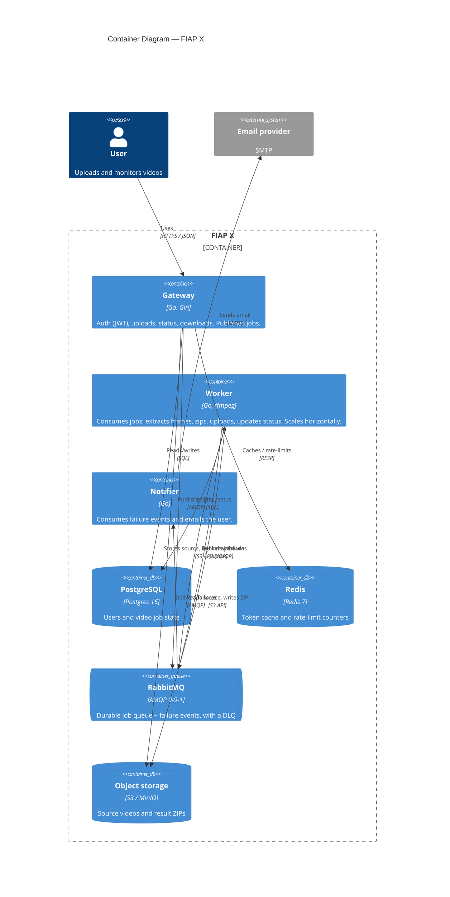

# FIAP X — Architecture

This is the reviewer-facing architecture document for the FIAP X video-processing
system. It links to the detailed [diagrams](./architecture/) and the
[decision records](./adr/) rather than duplicating them.

## 1. Problem & goals

The base project ([`legacy/base-project/`](../legacy/base-project/)) is a single
Go file that accepts a video upload and runs ffmpeg **synchronously** inside the
HTTP handler, writing frames to local disk. It has no authentication, no
persistence, no way to scale, and loses work under load.

The goal is to re-architect it into a system that:

- processes **many videos in parallel**,
- **never loses a request** during traffic spikes,
- is **protected by user + password**,
- offers a **per-user status listing**,
- **notifies the user on failure**,
- **persists data**, is **horizontally scalable**, **tested**, and shipped via
  **CI/CD**.

See the [requirements traceability matrix](./requirements-traceability.md) for a
requirement-by-requirement map to the implementation.

## 2. High-level architecture

Three independently deployable services communicate asynchronously through
RabbitMQ, backed by Postgres (state), Redis (cache), and S3/MinIO (blobs).

More views: [system context](./architecture/c4-context.md) ·
[runtime flow](./architecture/runtime-upload-flow.md) ·
[data model](./architecture/data-model.md) ·
[deployment topology](./architecture/deployment-topology.md).

## 3. Services

| Service | Package | Responsibility |
| ------- | ------- | -------------- |
| **gateway** | [`cmd/gateway`](../cmd/gateway), [`internal/gateway`](../internal/gateway) | Public HTTP API: register/login (JWT), upload (→ S3 + enqueue), per-user status, download. Does no heavy processing. |
| **worker** | [`cmd/worker`](../cmd/worker), [`internal/worker`](../internal/worker), [`internal/processing`](../internal/processing) | Consumes jobs, runs ffmpeg, zips frames, uploads result, updates status. Publishes a failure event on error. The only CPU-heavy tier. |
| **notifier** | [`cmd/notifier`](../cmd/notifier), [`internal/notifier`](../internal/notifier) | Consumes failure events and emails the affected user. |

Shared building blocks live in `internal/`: `config` (env config), `domain`
(core types), `platform` (DB/Redis/Rabbit connectors, logging, signals),
`repository/postgres`, `storage` (S3), `messaging` (queue topology + contracts),
`auth` (bcrypt + JWT), `mail` (SMTP), and `observability` (metrics).

## 4. Data & storage

- **Postgres** is the system of record: `users` and `videos`
  ([schema / DB creation script](../migrations/0001_init.up.sql)). `status` is a
  Postgres ENUM; a trigger maintains `updated_at`; the video→user FK cascades.
- **Redis** caches nothing critical — it holds rate-limit counters (and is the
  place to cache token/session lookups).
- **S3 / MinIO** stores the large blobs (source videos under `sources/…`, result
  archives under `results/<video_id>.zip`). The database stores only object keys.
  A separate public endpoint is used to **sign download URLs** so they are
  reachable by browser clients ([ADR-0008](./adr/0008-observability-prometheus-grafana.md)).

## 5. Messaging & the async pipeline

RabbitMQ decouples accepting work from doing it. Topology
([`internal/messaging`](../internal/messaging)):

- **jobs**: `videos.jobs` (durable) — the gateway publishes one persistent
  message per upload; workers consume competitively. Rejected messages
  dead-letter to `videos.jobs.dlq`.
- **events**: `videos.events` (topic) → `videos.notifications` — the worker
  publishes failures; the notifier consumes them.

The [runtime flow](./architecture/runtime-upload-flow.md) shows the full
sequence. Uploads return **202 Accepted** immediately after enqueuing.

## 6. Scalability & resilience

- **Parallelism / scale-out**: the worker is stateless; run N replicas
  (`--scale worker=N` in compose, or the **HorizontalPodAutoscaler** in
  Kubernetes, 2→6 on CPU). Competing consumers spread jobs automatically.
- **Spike safety**: the durable queue buffers bursts; the gateway only enqueues,
  so it stays responsive. Nothing is processed inline.
- **At-least-once + idempotency**: manual acks mean a crash mid-job redelivers
  the message. `worker.Handle` is idempotent (skips already-`DONE` videos,
  writes to a deterministic result key). Infra errors retry once then
  dead-letter; processing failures are recorded and acked.
- **Rate limiting**: a Redis fixed-window limiter on auth endpoints, enforced
  across all gateway replicas.
- **Graceful shutdown**: every service drains in-flight work on SIGTERM.

## 7. Security

- Passwords hashed with **bcrypt**; never stored or logged in plaintext.
- Stateless **JWT** (HS256) auth; the token middleware rejects the wrong
  algorithm (guards against alg-confusion).
- **Ownership checks**: a user can only see/download their own videos; others
  get 404 (existence is not revealed). Login returns a uniform 401 to avoid
  email enumeration.
- Secrets are injected via environment, never baked into the image or the repo.
  Locally they come from compose env / a Kubernetes `Secret`; on AWS the **External
  Secrets Operator** syncs them from **AWS Secrets Manager**
  ([ADR-0009](./adr/0009-secrets-external-secrets-operator.md)).

## 8. Observability

Every service exposes Prometheus metrics (`fiapx_<service>_<name>`): gateway HTTP
rate/latency, worker jobs-by-outcome + duration histogram + in-flight gauge,
notifier deliveries. Prometheus scrapes them; a provisioned **Grafana** dashboard
("FIAP X — Overview") ships in [`infra/grafana`](../infra/grafana). Structured
JSON logs (via `slog`) are emitted in production. See
[ADR-0008](./adr/0008-observability-prometheus-grafana.md).

## 9. Deployment

- **Docker Compose** ([`docker-compose.yml`](../docker-compose.yml)) runs the
  whole system — services, backing stores, and monitoring — with one command.
- **Kubernetes** ([`infra/k8s`](../infra/k8s)) provides Deployments, Services,
  an Ingress, probes wired to `/healthz` + `/readyz`, ConfigMap/Secret, a
  migration Job, and the worker HPA. Verified on minikube.
- **AWS / EKS** ([`infra/terraform`](../infra/terraform) +
  [`infra/k8s/overlays/aws`](../infra/k8s/overlays/aws)): EKS with managed RDS and
  S3, images from GHCR, and secrets via the External Secrets Operator; Redis,
  RabbitMQ, and Mailpit stay in-cluster.

See [ADR-0007](./adr/0007-deployment-compose-and-kubernetes.md) and the
[deployment topology](./architecture/deployment-topology.md).

## 10. Testing & CI/CD

- **Unit tests** use in-memory fakes (no external services) — auth, gateway
  handlers, worker/notifier logic, config, zip, SMTP formatting.
- **Integration tests** (build tag `integration`) exercise real Postgres, Redis,
  Mailpit, and the ffmpeg pipeline.
- **CI/CD** ([`.github/workflows/ci.yml`](../.github/workflows/ci.yml)): lint,
  build, unit + integration tests against service containers, then build and push
  the three images to GHCR on `main`.
- **Code quality** ([`.github/workflows/sonar.yml`](../.github/workflows/sonar.yml)):
  a SonarCloud scan with Go coverage runs on every push and pull request.

## 11. Technology choices

| Concern | Choice | Rationale (ADR) |
| ------- | ------ | --------------- |
| Language | Go | [0003](./adr/0003-language-and-runtime-go.md) |
| Decomposition | 3 microservices | [0002](./adr/0002-microservice-decomposition.md) |
| Messaging | RabbitMQ (queue + DLQ) | [0004](./adr/0004-asynchronous-processing-rabbitmq.md) |
| Object storage | S3 / MinIO | [0005](./adr/0005-object-storage-s3-minio.md) |
| Datastores | Postgres + Redis | [0006](./adr/0006-datastores-postgres-redis.md) |
| Deployment | Compose + Kubernetes | [0007](./adr/0007-deployment-compose-and-kubernetes.md) |
| Observability | Prometheus + Grafana | [0008](./adr/0008-observability-prometheus-grafana.md) |

The full decision log is in [`docs/adr/`](./adr/).
