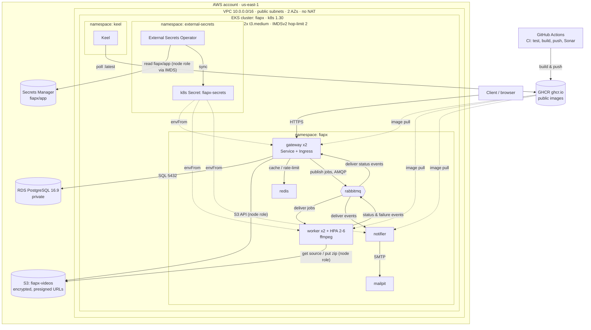

# AWS / EKS cloud topology

The deployed topology on Amazon EKS (as provisioned by
[`infra/terraform`](../../infra/terraform) and
[`infra/k8s/overlays/aws`](../../infra/k8s/overlays/aws)). Dashed edges are image
pulls / secret injection; everything else is a runtime dependency.

> **Auth:** there is no IRSA in AWS Academy Learner Lab, so pods (and the External
> Secrets Operator) authenticate to S3 and Secrets Manager via the **EKS node role
> (`LabRole`) over IMDS** (node launch template hop-limit 2). No NAT gateway —
> nodes sit in public subnets.

