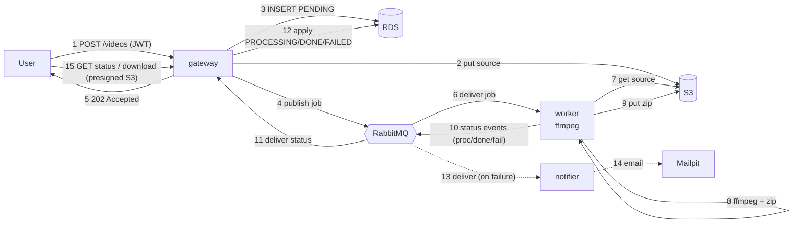
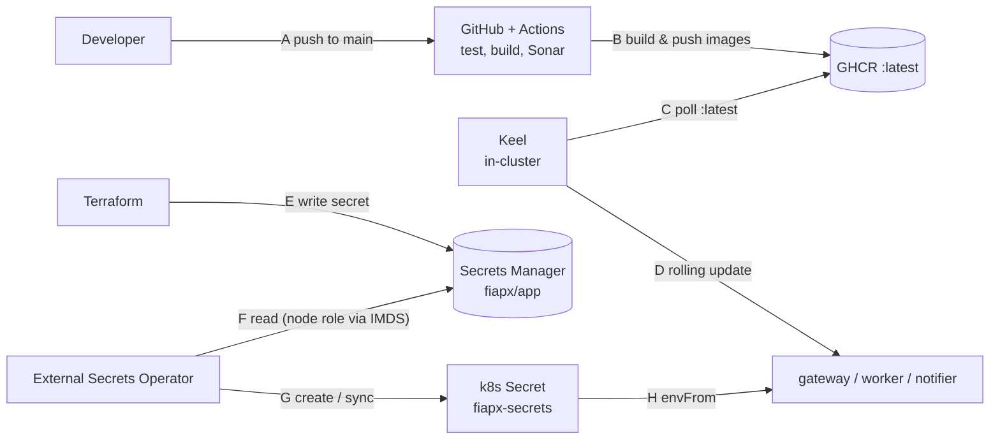

# Workflow — runtime and CI/CD

The two flows that move through the [AWS topology](./aws-topology.md): the runtime
request/processing path, and the CI/CD + secrets-sync path.

## Runtime flow

Numbered from the upload; the failure branch (13–14) is dashed. Uploads return
202 immediately; processing happens asynchronously on the worker. The worker owns
no database — it publishes status events (10) and the gateway, the sole writer,
applies them to RDS (11–12).

## CI/CD & secrets flow

Routine pushes deploy themselves: CI publishes images and Keel rolls them out —
no AWS credentials in the loop. Secrets are synced from AWS Secrets Manager by the
External Secrets Operator.

