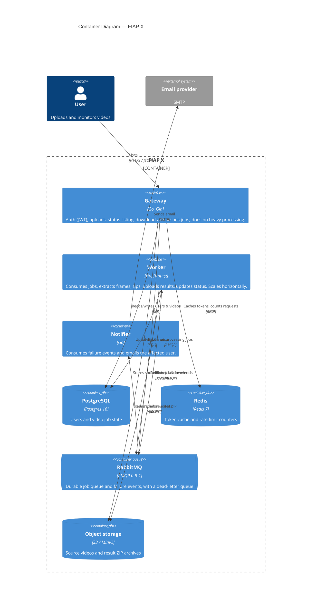

# C4 — Containers

The deployable units inside FIAP X and how they collaborate. The **worker** is
the only CPU-heavy tier and scales out horizontally; the **gateway** only
validates, stores, and enqueues, so uploads return quickly.

