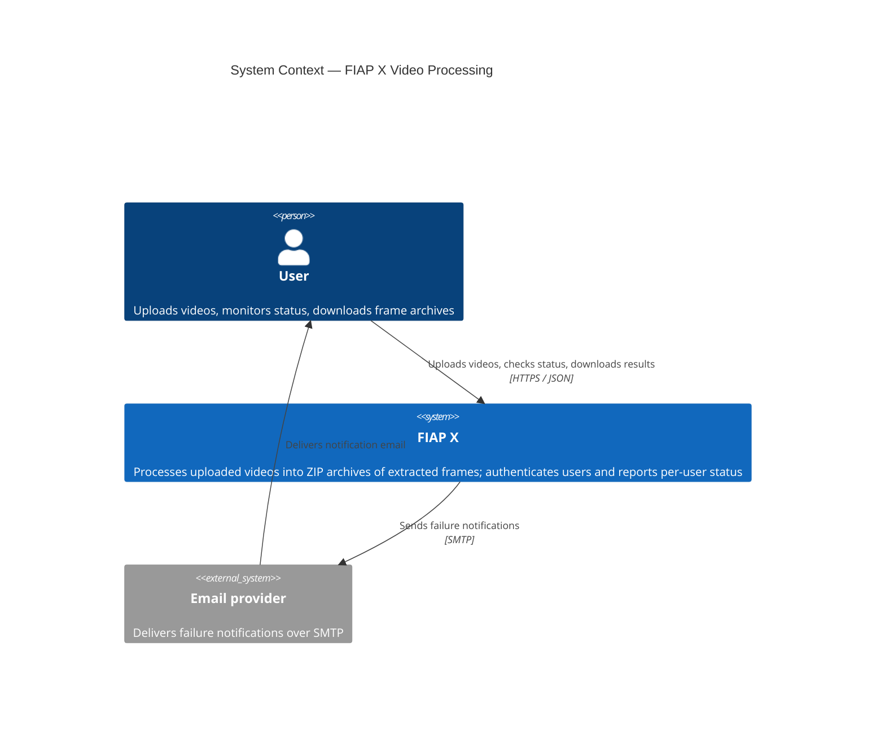

# C4 — System Context

FIAP X as a black box: a user uploads videos and retrieves ZIP archives of the
extracted frames; the system emails the user when a job fails.

```mermaid
C4Context
    title System Context — FIAP X Video Processing

    Person(user, "User", "Uploads videos, monitors status, downloads frame archives")
    System(fiapx, "FIAP X", "Processes uploaded videos into ZIP archives of extracted frames; authenticates users and reports per-user status")
    System_Ext(mail, "Email provider", "Delivers failure notifications over SMTP")

    Rel(user, fiapx, "Uploads videos, checks status, downloads results", "HTTPS / JSON")
    Rel(fiapx, mail, "Sends failure notifications", "SMTP")
    Rel(mail, user, "Delivers notification email")

    UpdateLayoutConfig($c4ShapeInRow="3", $c4BoundaryInRow="1")
```
