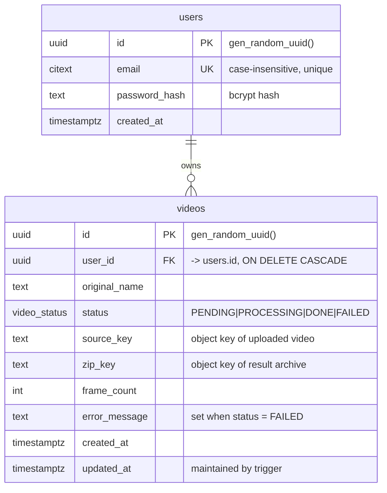
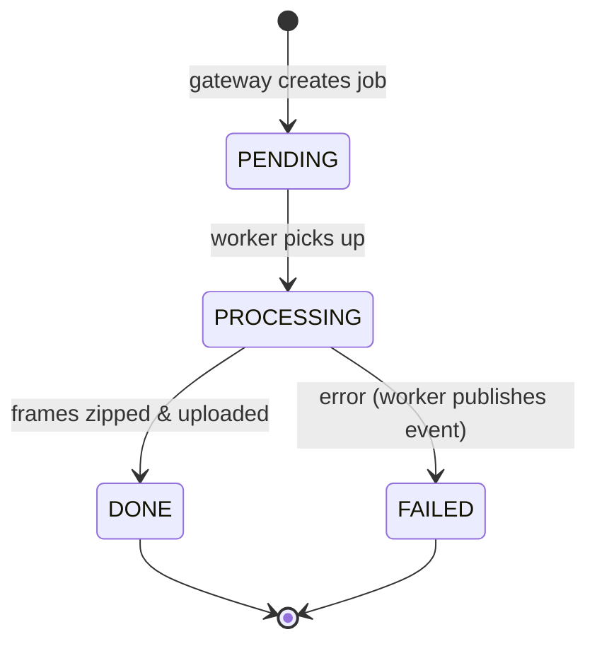

# Data model

The Postgres schema (see [`migrations/0001_init.up.sql`](../../migrations/0001_init.up.sql)).
A user owns many videos; deleting a user cascades to their videos. `status` is a
Postgres ENUM, and `updated_at` is maintained by a trigger.

## Status lifecycle

