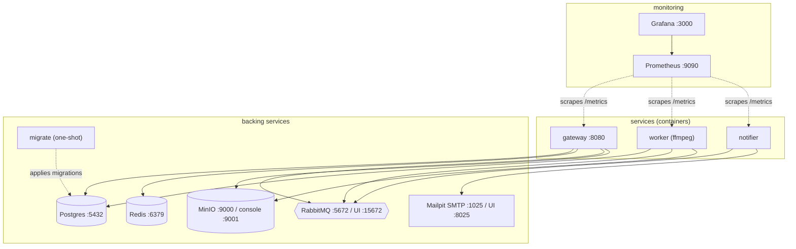
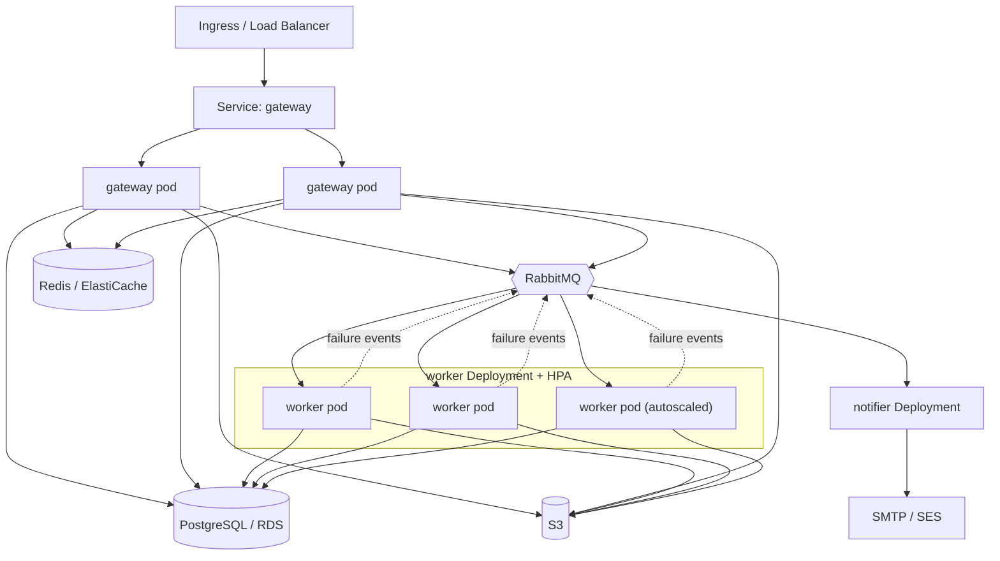

# Deployment topology

Two deployment targets ([ADR-0007](../adr/0007-deployment-compose-and-kubernetes.md)):
Docker Compose for local development/demo, Kubernetes for the scalable production
story.

## Development — Docker Compose

The whole system runs in the compose network: the three services are
containerized (the worker's image includes ffmpeg), and Prometheus + Grafana
provide monitoring. Only published ports are reachable from the host. Services
can still be run individually on the host via `go run` for fast iteration.

## Production — Kubernetes

Each service is a Deployment. The worker carries a HorizontalPodAutoscaler so the
CPU-heavy tier scales on load independently of the API tier. Managed AWS services
(RDS, ElastiCache, S3, SES) can replace the in-cluster backing services.

