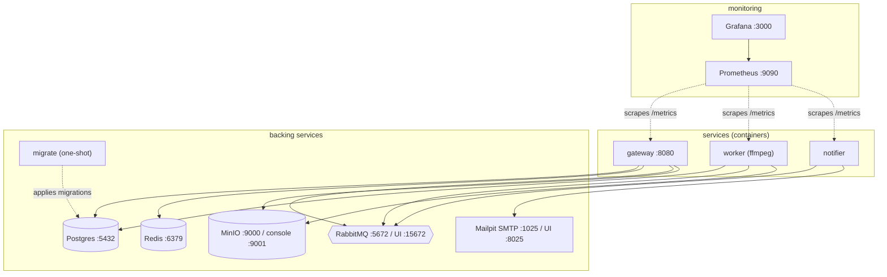
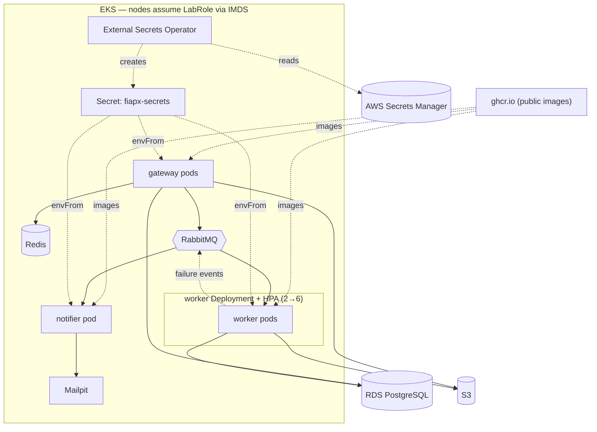

# Deployment topology

Two deployment targets ([ADR-0007](../adr/0007-deployment-compose-and-kubernetes.md)):
Docker Compose for local development/demo, Kubernetes for the scalable production
story.

## Development — Docker Compose

The whole system runs in the compose network: the three services are
containerized (the worker's image includes ffmpeg), and Prometheus + Grafana
provide monitoring. Only published ports are reachable from the host. Services
can still be run individually on the host via `go run` for fast iteration.

## Production — AWS / EKS

Deployed from the [`infra/k8s/overlays/aws`](../../infra/k8s/overlays/aws) overlay
onto EKS (provisioned by [`infra/terraform`](../../infra/terraform)). Postgres is
managed **RDS** and video storage is **S3**; Redis, RabbitMQ, and Mailpit run
in-cluster. Images are pulled from **public GHCR**. Application secrets are synced
from **AWS Secrets Manager** by the **External Secrets Operator (ESO)** into a
Kubernetes Secret. The worker's HorizontalPodAutoscaler scales the CPU-heavy tier
(2→6 on CPU).

Because AWS Academy Learner Lab forbids IRSA, both the app and ESO authenticate to
AWS with the **EKS node role (`LabRole`) via IMDS** — no static credentials in the
cluster ([ADR-0009](../adr/0009-secrets-external-secrets-operator.md)).

